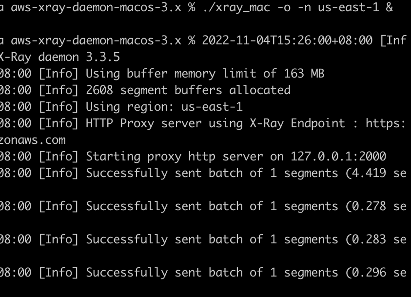
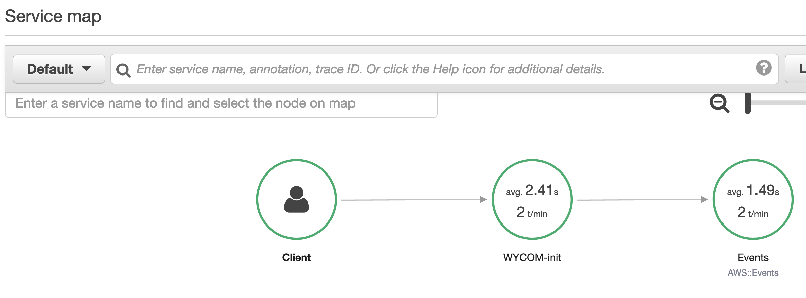

# EventBridgeWithXrayJavaV2

PutEventSXrayTest 可以实现Xray的EventBridge的Event消息发送。

注意

执行代码的本地需要启动Xray守护程序，部署和启动方法

https://docs.aws.amazon.com/xray/latest/devguide/xray-daemon-local.html

发送消息时，可以看到Xray守护程序从2000端口接受数据后转发个Xray

在XRay中，ServiceMap中可以看到调用链路图

